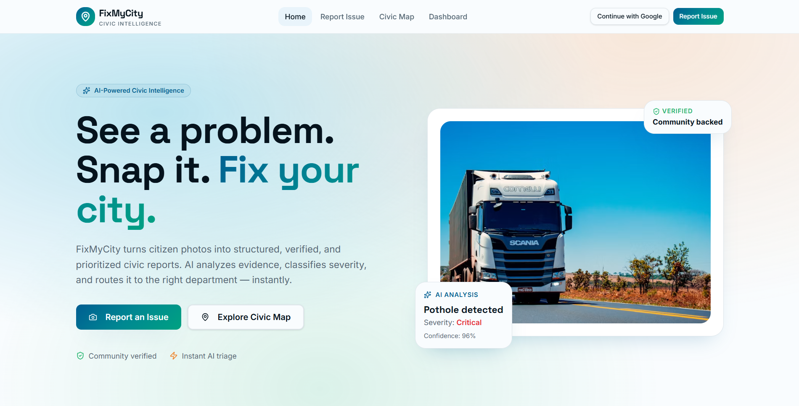
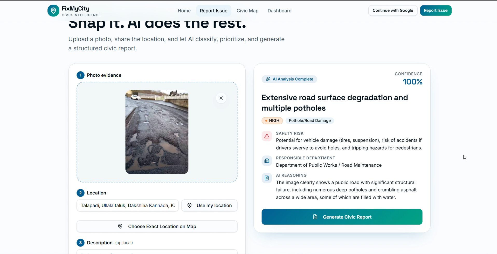
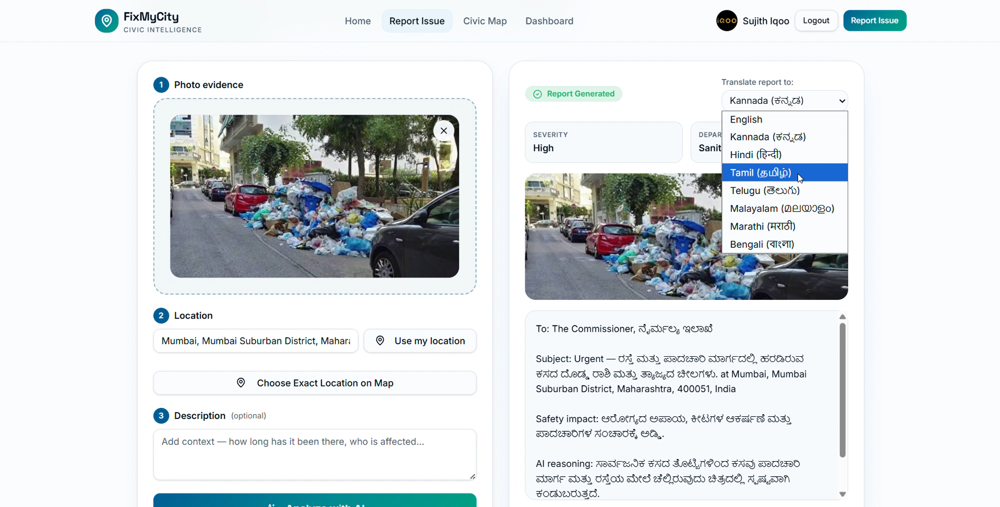
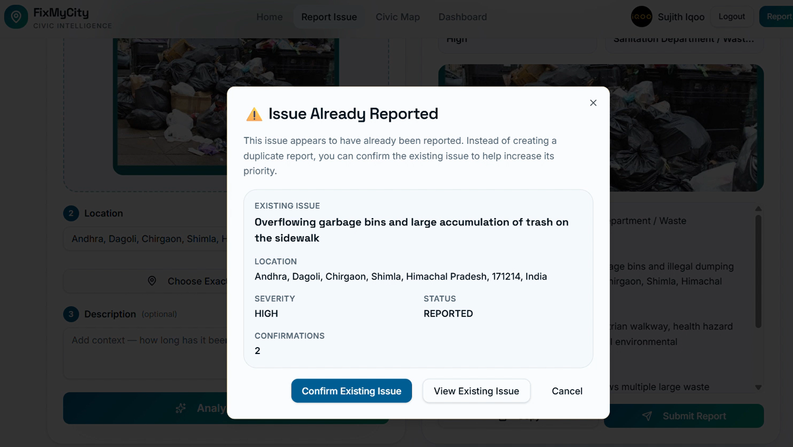
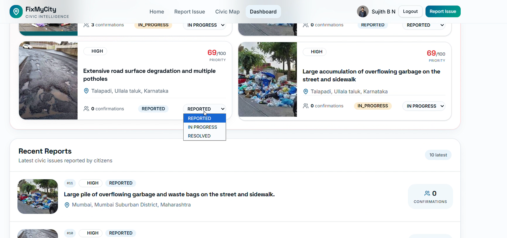

<div align="center">

# 🏙️ FixMyCity

### See it. Report it. Fix it.

**An AI-powered civic intelligence platform that transforms citizen photos into structured, verified, community-backed, and actionable civic reports.**

<br>

### 🌐 [Launch Live Application](https://sujith-bn-civic-eye-ai-35.sujith-bn.workers.dev/) &nbsp; • &nbsp; 🎥 [Watch Video Demo](https://youtu.be/CJ9JKH-F_kE)

<br>

`AI Analysis` • `Smart Location` • `Duplicate Detection` • `Community Verification` • `Multilingual Access` • `Civic Map` • `Resolution Tracking`

</div>

---



---

# 💡 What if reporting a city problem took only a photo?

Every day, citizens see:

🕳️ Potholes  
🗑️ Overflowing garbage  
💡 Broken infrastructure  
🚰 Water-related problems  
⚠️ Public safety hazards

But reporting them is often harder than noticing them.

Citizens may need to figure out:

- What exactly should I call this issue?
- Which category does it belong to?
- Which department should handle it?
- How serious is it?
- Has somebody already reported it?
- What happens after I submit it?

**FixMyCity simplifies that entire journey.**

```text
📸 CAPTURE
     ↓
🤖 UNDERSTAND
     ↓
📍 LOCATE
     ↓
🔍 CHECK
     ↓
👍 VERIFY
     ↓
📊 PRIORITIZE
     ↓
🏛️ ACT
     ↓
✅ RESOLVE
```

> **FixMyCity is not just a complaint form.**
>
> It turns citizen observations into structured civic intelligence.

---

# 🚨 The Problem Nobody Talks About

Imagine five citizens see the same dangerous pothole.

A traditional complaint system may do this:

```text
Citizen A ─────→ Complaint #101

Citizen B ─────→ Complaint #147

Citizen C ─────→ Complaint #203

Citizen D ─────→ Complaint #281

Citizen E ─────→ Complaint #346
```

### Result:

```text
5 DATABASE RECORDS

1 ACTUAL PROBLEM
```

More complaints do not necessarily mean more problems.

Sometimes they mean:

> **More citizens are affected by the same problem.**

FixMyCity treats that differently.

```text
                ONE CIVIC ISSUE
                       │
                 First Report
                       │
          ┌────────────┼────────────┐
          ▼            ▼            ▼
      Citizen B    Citizen C    Citizen D
       CONFIRMS     CONFIRMS     CONFIRMS
          └────────────┼────────────┘
                       ▼
              STRONGER COMMUNITY
                   SIGNAL
```

### One issue.

### One source of truth.

### Many citizen voices.

---

# ⚡ How FixMyCity Works

```text
Citizen sees a civic problem
            │
            ▼
     📸 Uploads evidence
            │
            ▼
       🤖 AI Analysis
            │
            ├── Issue
            ├── Category
            ├── Severity
            ├── Safety Risk
            └── Department
            │
            ▼
       📍 Add Location
            │
            ▼
    🔍 Duplicate Intelligence
            │
       ┌────┴────┐
       │         │
      NEW      EXISTING
       │         │
       ▼         ▼
    REPORT    CONFIRM
       │         │
       └────┬────┘
            ▼
     🗺️ Civic Ecosystem
            │
            ▼
      🏛️ Admin Action
            │
            ▼
REPORTED → IN_PROGRESS → RESOLVED
```

---

# 🤖 01 — AI-Assisted Civic Reporting

A citizen should not need to understand government classifications before reporting a broken road.

Start with what they already have:

## A photo.

FixMyCity uses AI-assisted analysis to transform visual evidence into structured civic information.



The analysis can help identify:

- 🔎 Detected civic issue
- 🗂️ Issue category
- 🚨 Severity
- ⚠️ Safety risk
- 🏛️ Relevant department
- 📊 Confidence
- 🧠 Human-readable reasoning

The idea is simple:

```text
Citizen provides evidence
          +
AI provides structure
          =
Better civic information
```

AI assists the citizen.

It does not control authentication, authorization, confirmations, or resolution status.

---

# 📍 02 — Give Every Problem a Place

A civic issue without location is difficult to act on.

FixMyCity connects reports with geographic context using:

```text
Browser Geolocation
        +
Latitude / Longitude
        +
Readable Location
        +
Civic Map Context
```

This does more than display an address.

Location becomes part of the system's ability to understand whether multiple citizens may be reporting the **same real-world civic issue**.

---

# 🌐 03 — Civic Reporting Should Have No Language Barrier

Cities are multilingual.

Civic technology should be too.

FixMyCity allows generated civic report information to be viewed in multiple supported languages.



The system supports language accessibility including:

```text
English     → English
Kannada     → ಕನ್ನಡ
Hindi       → हिन्दी
Tamil       → தமிழ்
Telugu      → తెలుగు
Malayalam   → മലയാളം
Marathi     → मराठी
Bengali     → বাংলা
```

But there is an important architectural principle:

> **Translation changes how information is presented — not the integrity of the underlying report.**

Canonical values remain stable for core application logic such as:

- Categories
- Duplicate detection
- Status
- Coordinates
- Dashboard logic
- Administrative workflows

```text
                 CANONICAL REPORT
                       │
       ┌───────────────┼───────────────┐
       ▼               ▼               ▼
    English          हिन्दी           ಕನ್ನಡ
       ▼               ▼               ▼
     தமிழ்           తెలుగు          മലയാളം
```

### Accessibility without sacrificing data consistency.

---

# 🔍 04 — What If the Issue Already Exists?

This is one of the core ideas behind FixMyCity.

Duplicate detection is not as simple as:

```text
Same image?

YES = DUPLICATE
```

Because real-world civic problems are more complicated.

### Different photos can represent the same issue.

Two citizens can photograph the same pothole from different angles.

```text
📷 Citizen A

      SAME POTHOLE

📷 Citizen B
```

Different files.

Same real-world issue.

### Nearby reports can also be completely different.

```text
Same street:

🕳️ Pothole

🗑️ Garbage pile

💡 Broken streetlight
```

Same area.

Three different problems.

So the better question is:

> ### Does this submission appear to represent an already-active civic issue?

FixMyCity uses contextual signals around:

```text
📍 Geographic Proximity
          +
🏷️ Issue / Category Context
          +
🖼️ Image Fingerprinting
          +
🔄 Active Issue Lifecycle
```

---

# ⚠️ Duplicate Found? Don't Create More Noise.

When FixMyCity identifies an existing issue, the citizen is not silently blocked.

They see what already exists.



The modal shows:

- Existing issue
- Location
- Severity
- Status
- Current confirmation count

The citizen can then choose:

```text
[ CONFIRM EXISTING ISSUE ]

[ VIEW EXISTING ISSUE ]

[ CANCEL ]
```

FixMyCity does **not automatically upvote** the issue.

The citizen explicitly decides whether to confirm it.

---

# 👍 05 — Turn Duplicate Complaints Into Community Verification

This changes the meaning of repeated reports.

### Traditional model

```text
ONE POTHOLE

├── Complaint
├── Complaint
├── Complaint
├── Complaint
└── Complaint

= DUPLICATE NOISE
```

### FixMyCity model

```text
ONE POTHOLE

├── Original Report
├── 👍 Confirmation
├── 👍 Confirmation
├── 👍 Confirmation
└── 👍 Confirmation

= COMMUNITY SIGNAL
```

Instead of asking:

> How many duplicate complaint records exist?

FixMyCity can begin asking:

> **How many citizens independently confirm this issue?**

That creates a stronger signal for civic prioritization.

---

## 🛡️ Confirmation Integrity

Community verification only works if confirmations mean something.

| Action | Allowed |
|---|:---:|
| Confirm another citizen's active issue | ✅ |
| Confirm your own report | ❌ |
| Confirm the same issue repeatedly | ❌ |
| Confirm a resolved issue | ❌ |
| Automatically upvote a duplicate | ❌ |

Critical confirmation rules are enforced beyond simply hiding buttons in the UI.

---

# 🔐 06 — Verified Reporting

Users can explore FixMyCity without immediately signing in.

But submitting a verified civic report requires authentication.

```text
EXPLORE
    │
    ▼
PREPARE REPORT
    │
    ▼
ATTEMPT SUBMISSION
    │
    ▼
AUTHENTICATION CHECK
    │
 ┌──┴───────────────┐
 │                  │
 ▼                  ▼
NOT SIGNED IN    AUTHENTICATED
 │                  │
 ▼                  ▼
SIGN IN          SUBMIT REPORT
```

FixMyCity uses Supabase authentication with Google sign-in in the application flow.

This provides accountability while keeping the initial experience accessible.

---

# 🗺️ 07 — Don't Just Store Problems. See the City.

Civic issues are geographic.

FixMyCity includes a map-based civic view so reports are not trapped inside a database table.

```text
                     💡
                Streetlight


      🗑️                             🕳️
    Garbage                         Pothole


                     🚰
                 Water Issue
```

The civic map helps users understand:

- Where issues exist
- Which areas have active problems
- What types of issues are being reported
- Issue severity
- Community confirmation
- Current status

This transforms isolated reports into a geographic civic picture.

---

# 📊 08 — From Reports to Priority

Not every issue has the same urgency.

FixMyCity brings together useful civic signals:

```text
             SEVERITY
                +
           AI CONTEXT
                +
        COMMUNITY SIGNAL
                +
              STATUS
                │
                ▼
        CIVIC PRIORITIZATION
```

The dashboard provides visibility into reported issues and their lifecycle.

---

# 🏛️ 09 — Reporting Is Only the Beginning

A civic platform should not end with:

```text
✅ Report Submitted Successfully
```

The real question is:

# Who resolves it?

FixMyCity models the complete lifecycle.



```text
┌────────────────┐
│    REPORTED    │
└───────┬────────┘
        │
        │ Authority begins action
        ▼
┌────────────────┐
│  IN_PROGRESS   │
└───────┬────────┘
        │
        │ Issue addressed
        ▼
┌────────────────┐
│    RESOLVED    │
└────────────────┘
```

Citizens report and verify.

Authorized administrators manage resolution status.

That separation matters.

If every citizen could simply click:

```text
RESOLVED ✅
```

then resolution statistics would have no meaning.

---

# 👥 Citizen vs Admin

| Capability | Citizen | Admin |
|---|:---:|:---:|
| Explore reports | ✅ | ✅ |
| Use AI-assisted analysis | ✅ | ✅ |
| Submit authenticated reports | ✅ | ✅ |
| View Civic Map | ✅ | ✅ |
| Use multilingual report display | ✅ | ✅ |
| Confirm another user's active issue | ✅ | ✅ |
| Confirm own issue | ❌ | ❌ |
| Repeatedly confirm same issue | ❌ | ❌ |
| Change civic status | ❌ | ✅ |
| Move issue to `IN_PROGRESS` | ❌ | ✅ |
| Mark issue `RESOLVED` | ❌ | ✅ |

---

# 🧠 Three Layers of Civic Intelligence

FixMyCity connects three different forms of intelligence.

## 🤖 Machine Intelligence

```text
IMAGE
  ↓
AI UNDERSTANDING
  ↓
STRUCTURED REPORT
```

## 👥 Community Intelligence

```text
REPORT
  ↓
DUPLICATE AWARENESS
  ↓
CONFIRMATIONS
  ↓
COMMUNITY SIGNAL
```

## 🏛️ Operational Intelligence

```text
REPORTED
  ↓
IN_PROGRESS
  ↓
RESOLVED
```

Together:

```text
        AI
         +
     COMMUNITY
         +
     AUTHORITY
         │
         ▼
  CIVIC INTELLIGENCE
```

---

# 🏗️ Architecture

```text
┌──────────────────────────────────────────────────────┐
│                     CITIZEN                          │
└─────────────────────────┬────────────────────────────┘
                          │
                          ▼
┌──────────────────────────────────────────────────────┐
│                 FIXMYCITY WEB APP                    │
│                                                      │
│       React • TypeScript • Responsive UI             │
└────────┬────────────────┬─────────────────┬──────────┘
         │                │                 │
         ▼                ▼                 ▼
┌──────────────┐   ┌──────────────┐   ┌──────────────┐
│     AUTH     │   │      AI      │   │ MAP/LOCATION │
│              │   │              │   │              │
│ Supabase     │   │ Analysis     │   │ Geolocation  │
│ Google Login │   │ Translation  │   │ Leaflet      │
└──────┬───────┘   └──────┬───────┘   └──────┬───────┘
       │                  │                  │
       └──────────────────┼──────────────────┘
                          ▼
                 ┌─────────────────┐
                 │  SERVER LOGIC   │
                 └────────┬────────┘
                          ▼
┌──────────────────────────────────────────────────────┐
│                     SUPABASE                         │
│                                                      │
│ PostgreSQL • Authentication • Storage • RPC          │
└───────────────┬──────────────────────┬───────────────┘
                │                      │
                ▼                      ▼
       ┌────────────────┐     ┌──────────────────┐
       │ DUPLICATE      │     │ CIVIC WORKFLOW   │
       │ INTELLIGENCE   │     │                  │
       │                │     │ Confirmations    │
       │ Geography      │     │ Authorization    │
       │ Issue Context  │     │ Status Lifecycle │
       │ Fingerprinting │     │                  │
       └────────┬───────┘     └─────────┬────────┘
                │                       │
                └───────────┬───────────┘
                            ▼
                   ┌──────────────────┐
                   │ MAP + DASHBOARD  │
                   └────────┬─────────┘
                            ▼
                   ┌──────────────────┐
                   │ AUTHORIZED ADMIN │
                   │                  │
                   │    REPORTED      │
                   │       ↓          │
                   │  IN_PROGRESS     │
                   │       ↓          │
                   │    RESOLVED      │
                   └──────────────────┘
```

---

# 🛠️ Tech Stack

| Layer | Technology |
|---|---|
| ⚛️ Frontend | React + TypeScript |
| 🧭 Application / Routing | TanStack |
| ⚡ Build | Vite |
| 🗄️ Database | PostgreSQL + Supabase |
| 🔐 Authentication | Supabase Auth + Google Sign-In |
| 🖼️ Image Storage | Supabase Storage |
| 🤖 Intelligence | AI-assisted analysis & translation |
| 🗺️ Maps | Leaflet + Browser Geolocation |
| 🔍 Duplicate Intelligence | Geography + issue context + image fingerprinting |
| ☁️ Deployment | Cloudflare Workers / Nitro |
| 🔧 Development | Git + GitHub |

---

# 🔒 Built With Integrity in Mind

Some rules should never depend only on whether a button is visible.

```text
AUTHENTICATION
      │
      └── Verified report submission

CONFIRMATION INTEGRITY
      │
      ├── No self-confirmation
      ├── No repeated confirmation
      └── No confirmation after resolution

AUTHORIZATION
      │
      └── Controlled civic status transitions

DATA INTEGRITY
      │
      └── Stable canonical report values

SECRETS
      │
      └── Sensitive API configuration stays server-side
```

### UI improves experience.

### Backend rules preserve trust.

---

# 🎥 Watch the Complete Story

The demo follows six simple questions:

```text
01 ── Welcome to FixMyCity

02 ── Can anyone report an issue without signing in?

03 ── Why is sign-in required for verified reporting?

04 ── Should civic reporting have a language barrier?

05 ── What if the same civic issue is reported again?

06 ── Reporting is only the beginning. Who resolves it?
```

And the answer becomes:

```text
CITIZENS REPORT
       ↓
AI STRUCTURES
       ↓
COMMUNITIES VERIFY
       ↓
AUTHORITIES ACT
       ↓
CITIES IMPROVE
```

<div align="center">

### ▶️ [WATCH THE FULL FIXMYCITY DEMO](https://youtu.be/CJ9JKH-F_kE)

</div>

---

# 🚀 Run Locally

### 1. Clone

```bash
git clone https://github.com/Sujith-BN/civic-eye-ai-35.git
cd civic-eye-ai-35
```

### 2. Install

```bash
npm install
```

### 3. Configure Environment

Use the example environment configuration included in the repository and provide your own valid credentials.

Never commit real API secrets.

### 4. Start Development

```bash
npm run dev
```

### 5. Type Check

```bash
npx tsc --noEmit
```

### 6. Production Build

```bash
npm run build
```

---

# 🔮 What's Next?

FixMyCity demonstrates the complete civic reporting lifecycle today.

The idea can grow much further.

### 🏛️ Direct Municipal Integration

Automatically route verified reports to the responsible civic department.

### 🔔 Real-Time Citizen Updates

```text
REPORTED
   ↓
ACKNOWLEDGED
   ↓
CREW ASSIGNED
   ↓
IN_PROGRESS
   ↓
RESOLVED
```

### 🔥 Civic Heatmaps

Identify recurring infrastructure problems and high-impact areas.

### 📊 Ward-Level Analytics

Track issue density, response time, recurring problems, and resolution performance.

### 🧠 Advanced Visual Similarity

Combine:

```text
Geography
    +
Issue Classification
    +
Image Embeddings
    +
Visual Similarity
    +
Time Context
```

to improve real-world duplicate matching.

### 📱 Mobile-First Civic Reporting

```text
SNAP
  ↓
AUTO-LOCATE
  ↓
AI ANALYZE
  ↓
REPORT
```

---

# 🌍 The Vision

Cities don't need more disconnected complaint records.

They need better signals.

```text
       CITIZEN EVIDENCE
              +
       AI UNDERSTANDING
              +
      LOCATION CONTEXT
              +
    COMMUNITY VERIFICATION
              +
     AUTHORITY WORKFLOW
              │
              ▼
       BETTER CIVIC ACTION
```

FixMyCity explores a simple idea:

> **What if reporting a city problem didn't end with submitting a complaint?**

What if that report could be understood, verified, prioritized, tracked, and resolved?

That is the future FixMyCity is built to explore.

---

<div align="center">

# 🏙️ FixMyCity

### See it. Report it. Fix it.

<br>

**📸 REPORT**

↓

**🤖 UNDERSTAND**

↓

**👍 VERIFY**

↓

**📊 PRIORITIZE**

↓

**🏛️ ACT**

↓

**✅ RESOLVE**

<br>

### One issue. One source of truth. Many citizen voices.

<br>

### [🌐 LAUNCH FIXMYCITY](https://sujith-bn-civic-eye-ai-35.sujith-bn.workers.dev/)

### [▶️ WATCH THE DEMO](https://youtu.be/CJ9JKH-F_kE)

<br>

**Built for Hackathon 2026 🚀**

*Smarter reporting • Stronger communities • Better cities*

</div>
